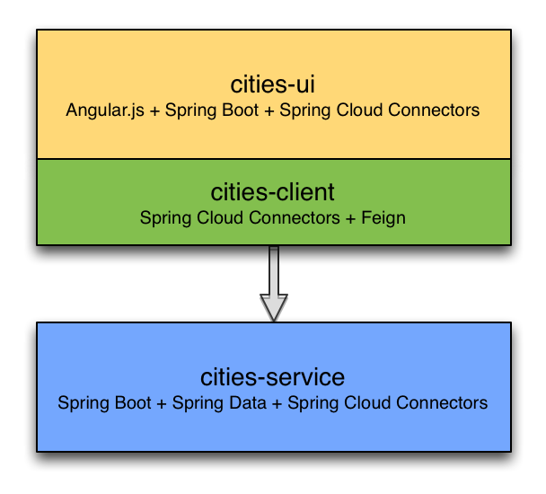

= Building and consuming a cloud-ready Microservice

This repository contains a sample project to demonstrate building and deploying a simple Spring Boot based microservice and a web app to consume the microservice. It was built in part to be used as part of a http://www.slideshare.net/ramnivas2/spring-one2014-springcloudconnector[presentation on Spring Cloud Connectors].

This project contains three sub-projects:

The following sections describe the components from the bottom up.

=== cities-service

The **cities-service** subproject is an example of a very simple but fully functional microservice. The microservice is built using http://projects.spring.io/spring-boot[Spring Boot]. It uses http://projects.spring.io/spring-data-jpa[Spring Data JPA] to access a database and http://projects.spring.io/spring-data-rest[Spring Data REST] to expose the database contents via a REST API. http://cloud.spring.io/spring-cloud-connectors[Spring Cloud Connectors] is used to create the database connection from information exposed by the cloud environment.

This subproject also provides a link:cities-service/demo-script.adoc[script] that can be used to demonstrate construction and deployment of a microservice from scratch with just a few source code files.

**Key concepts:**

* Simple application configuration using Spring Boot
** link:cities-service/src/main/java/com/example/cities/Application.java[Application.java]
** link:cities-service/src/main/java/com/example/cities/WebConfiguration.java[WebConfiguration.java]
* Data access using Spring Data JPA and exposing a REST API using Spring Data REST
** link:cities-service/src/main/java/com/example/cities/repositories/CityRepository.java[CityRepository.java]
* Consuming a cloud data source using Spring Cloud Connectors
** link:cities-service/src/main/java/com/example/cities/config/CloudDataSourceConfig.java[CloudDataSourceConfig.java]

=== cities-client

The **cities-client** subproject provides a client library for use by Java apps consuming the microservice. The main goal of this library is to show an example of a http://cloud.spring.io/spring-cloud-connectors[Spring Cloud Connectors] extension for consuming a microservice in a cloud environment.

The client library uses https://github.com/Netflix/feign[Feign] to expose the microservice REST API using a http://martinfowler.com/eaaCatalog/repository.html[Repository] pattern. This provides a nice analog to the Repository abstraction used by Spring Data.

The same Spring Cloud Connectors extension technique could be used to create lower-level REST API connection objects like Spring http://docs.spring.io/spring/docs/current/spring-framework-reference/htmlsingle/#rest-resttemplate[RestTemplate] or https://hc.apache.org/httpcomponents-client-ga[Apache HttpClient].

**Key concepts:**

* A `ServiceInfo` class to model the connection information needed to access the REST API (just a URL in this example)
** link:cities-client/src/main/java/com/example/cities/client/cloud/WebServiceInfo.java[WebServiceInfo.java]
* A `ServiceInfoCreator` class to populate the `ServiceInfo` class from information exposed by Cloud Foundry
** link:cities-client/src/main/java/com/example/cities/client/cloud/cloudfoundry/CitiesWebServiceInfoCreator.java[CitiesWebServiceInfoCreator.java]
* A `ServiceConnectionCreator` class to create the Feign repository from the information contained in the `ServiceInfo`
** link:cities-client/src/main/java/com/example/cities/client/CityRepository.java[CityRepository.java]
** link:cities-client/src/main/java/com/example/cities/client/CityRepositoryFactory.java[CityRepositoryFactory.java]
** link:cities-client/src/main/java/com/example/cities/client/cloud/connector/CitiesRepositoryConnectionCreator.java[CitiesRepositoryConnectionCreator.java]
* Registration of the `ServiceInfoCreator` and `ServiceConnectionCreator` to the Spring Cloud Connectors framework
** link:cities-client/src/main/resources/META-INF/services/org.springframework.cloud.cloudfoundry.CloudFoundryServiceInfoCreator[CloudFoundryServiceInfoCreator]
** link:cities-client/src/main/resources/META-INF/services/org.springframework.cloud.service.ServiceConnectorCreator[ServiceConnectorCreator]

=== cities-ui

The **cities-ui** subproject is a web UI application that uses the client library to consume the microservice REST API. It is built using http://projects.spring.io/spring-boot[Spring Boot] and https://angularjs.org[AngularJS].

**Key concepts:**

* Simple application configuration using Spring Boot
** link:cities-ui/src/main/java/com/example/cities/Application.java[Application.java]
* Proxying calls from the AngularJS front-end to the repository backend with Spring MVC
** link:cities-ui/src/main/java/com/example/cities/controller/CitiesController.java[CitiesController.java]
* Consuming the client library using Spring Cloud Connectors
** link:cities-ui/src/main/java/com/example/cities/config/CloudConfiguration.java[CloudConfiguration.java]

== Building the project

To build applications and library, you will need to install http://www.gradle.org/installation[Gradle]. Once Gradle is installed, you can run this command from the project root:

[source,bash]
----
$ gradle assemble
----

== Deploying the apps to Cloud Foundry

To deploy the microservice and web UI applications to Cloud Foundry, you will need to:

* install the http://docs.cloudfoundry.org/devguide/installcf/install-go-cli.html[Cloud Foundry CLI]
* use the Cloud Foundry CLI to http://docs.cloudfoundry.org/devguide/installcf/whats-new-v6.html#login[log into your Cloud Foundry system]

=== Deploying the microservice

Use the following commands to create a database service instance for the microservice and push the microservice to Cloud Foundry:

[source,bash]
----
$ cf create-service [service-label] [service-plan] cities-db
$ cd cities-service && cf push && cd ..
----

==== Note on data import

The microservice loads a very large dataset at startup to show the power of the paging, sorting, and search capabilities in Spring Data. The default link:cities-service/src/main/resources/import.sql[`import.sql`] file contains just under 43,000 small rows (representing all postal codes in the United States) that get loaded when the application starts.

Free database service tiers on public Cloud Foundry services often limit the size of the database you can use and the number of records you can load at startup. You will likely need to reduce the size of the dataset when deploying to a public Cloud Foundry service with a free database tier. You can use the provided link:data/import-TX.sql[`import-TX.sql`], which contains just under 2,700 rows (representing postal codes in the US state of Texas), or you can edit the `import.sql` file to create your own subset.

The default `import.sql` file works with the in-memory HyperSQL database (HSQLDB) and MySQL. If you want the microservice to use a PostgreSQL database, you can use the link:data/import-pgsql.sql[`import-pgsql.sql`] import file or the reduced link:data/import-TX-pgsql.sql[`import-TX-pgsql.sql`] file.

To use any import file other than the default `import.sql`, copy the file from link:data[`data`] to link:cities-service/src/main/resources[`cities-service/src/main/resources`] and edit the file link:cities-service/src/main/resources/application.properties[`application.properties`] and add a line like this, using the appropriate file name:

[source]
----
spring.jpa.properties.hibernate.hbm2ddl.import_files=import-pgsql.sql
----

A path is not necessary, just the file name will suffice. You will need to re-build the .war file with `gradle assemble` after changing `application.properties`.

=== Deploying the web UI

Once the microservice is deployed and running, you can create a user-provided service with the connection details for the microservice (which will be used by the client library) and then push the web UI app:
[source,bash]
----
$ cf create-user-provided-service cities-ws -p '{ "citiesuri": "[route to cities-service]" }'
$ cd cities-ui && cf push && cd ..
----

